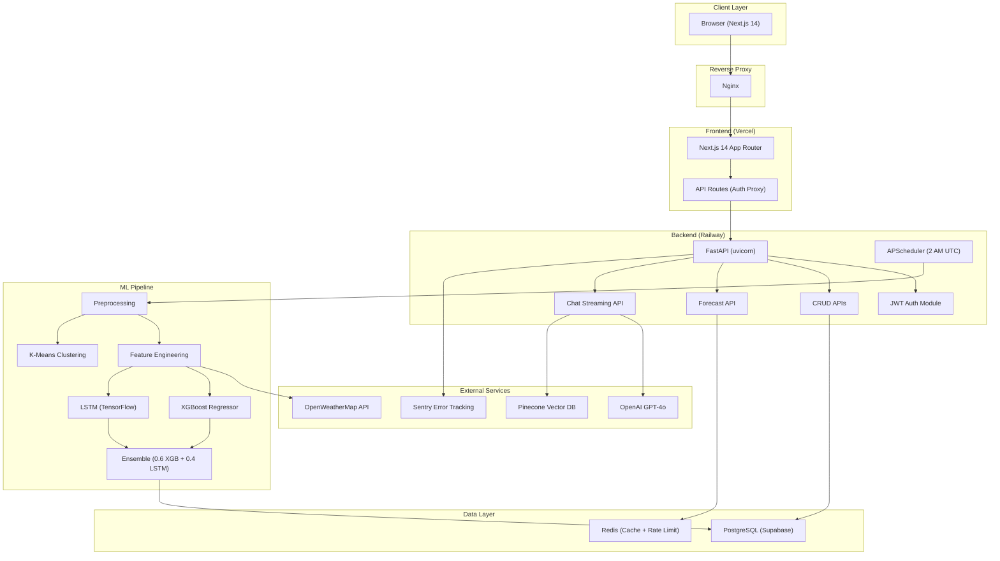
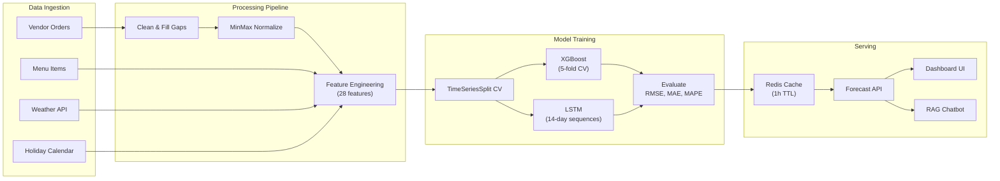
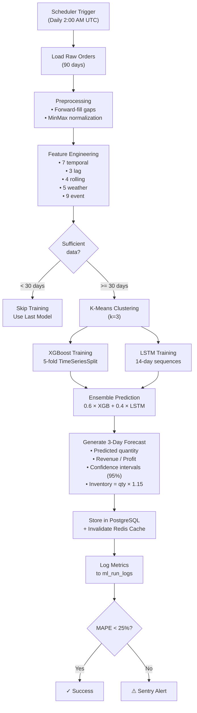

# System Architecture — AI Food Demand Forecasting Platform

## 1. Overview

The platform is a **multi-tenant SaaS** designed for Indian food vendors to forecast demand, reduce food waste, and optimize inventory using machine learning. It combines a **FastAPI** backend, **Next.js 14** frontend, an **XGBoost + LSTM ensemble** ML pipeline, and a **RAG-powered AI chatbot**.

---

## 2. High-Level Architecture

---

## 3. Data Flow Diagram

---

## 4. ML Pipeline Flowchart

---

## 5. Technology Choices & Justification

| Layer | Technology | Justification |
|---|---|---|
| **Backend** | FastAPI | Async support, auto-generated OpenAPI docs, Pydantic validation, 10x faster than Flask (Tiangolo, 2023) |
| **Frontend** | Next.js 14 (App Router) | Server-side rendering for SEO, React Server Components, streaming support, Vercel-native deployment |
| **Database** | PostgreSQL (Supabase) | ACID compliance, JSON support, Row-Level Security, managed hosting with automatic backups |
| **Cache** | Redis | Sub-millisecond reads, pub/sub for real-time, rate limiting with atomic INCR, forecast caching |
| **ML — Tabular** | XGBoost | State-of-the-art for tabular data (Chen & Guestrin, 2016), handles mixed features, built-in feature importance |
| **ML — Sequential** | LSTM | Captures long-term temporal dependencies in demand sequences (Hochreiter & Schmidhuber, 1997) |
| **ML — Clustering** | K-Means | Simple, interpretable demand segmentation (MacQueen, 1967), enables cluster-specific strategies |
| **AI Chatbot** | GPT-4o + RAG | Retrieval-Augmented Generation prevents hallucination on vendor-specific data (Lewis et al., 2020) |
| **Vector DB** | Pinecone | Managed vector search, namespace isolation per vendor, cosine similarity at scale |
| **Weather** | OpenWeatherMap | One Call API 3.0 for forecast + historical data, well-documented, free tier sufficient |
| **Deployment** | Docker + Railway + Vercel | Container isolation, Railway for backend auto-scaling, Vercel for edge-optimized frontend |
| **CI/CD** | GitHub Actions | Native GitHub integration, matrix builds, artifact caching, secret management |
| **Monitoring** | Sentry | Real-time error tracking, performance monitoring, release tracking |

---

## 6. Security Architecture

| Control | Implementation |
|---|---|
| **Authentication** | JWT (access + refresh tokens), bcrypt password hashing, HttpOnly cookies |
| **Multi-Tenancy** | vendor_id in every SQL query + `assert_vendor_ownership()` defense-in-depth |
| **Rate Limiting** | Redis-backed: 100 req/min per IP, 60 req/min per vendor token |
| **Headers** | X-Content-Type-Options, X-Frame-Options, HSTS, Referrer-Policy |
| **CORS** | Restricted to configured production domains only |
| **SQL Injection** | All queries via SQLAlchemy ORM (parameterized queries) |

---

## 7. Database Schema (Key Tables)

| Table | Key Columns | Purpose |
|---|---|---|
| `vendors` | id, email, hashed_password, business_name | Multi-tenant vendor accounts |
| `menu_items` | id, vendor_id, name, category, price, cost_% | Menu catalog per vendor |
| `orders` | id, vendor_id, customer_name, status, total | Order tracking |
| `order_items` | id, order_id, menu_item_id, quantity, price | Line items |
| `forecasts` | id, vendor_id, menu_item_id, forecast_date, qty, revenue | ML predictions |
| `ml_run_logs` | id, vendor_id, run_date, status, metrics | Training audit trail |
| `chat_sessions` | id, vendor_id, messages (JSONB) | RAG conversation history |
